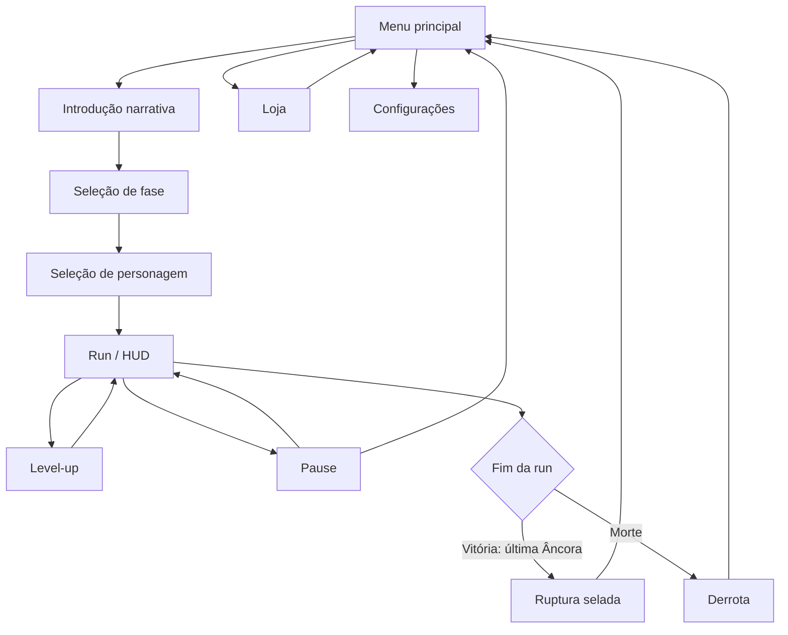
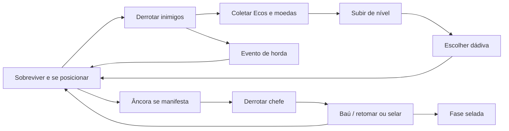

# Pantheon Survivors

## Game Design Document — Versão Final


| Campo                      | Valor                                                                                                                                                          |
| -------------------------- | -------------------------------------------------------------------------------------------------------------------------------------------------------------- |
| **Título**                 | Pantheon Survivors                                                                                                                                             |
| **Campanha**               | A Ruptura do Véu                                                                                                                                               |
| **High concept**           | Sobrevivência top-down em que mortais escolhidos pelos deuses selam fendas mitológicas, derrubando Âncoras enquanto hordas de vários panteões invadem a Terra. |
| **Gênero**                 | Survivors-like / horde survival, campanha em três fases                                                                                                        |
| **Plataforma**             | PC (Windows)                                                                                                                                                   |
| **Engine**                 | Godot 4.7 (renderer Forward Plus, Direct3D 12)                                                                                                                 |
| **Resolução-alvo**         | 1280 × 720, escala `canvas_items` com aspecto `expand`                                                                                                         |
| **Modo**                   | Single-player, sessões de 3 a 11 minutos por fase                                                                                                              |
| **Classificação sugerida** | 12+ (violência estilizada, sem gore realista)                                                                                                                  |
| **Status**                 | Build jogável da campanha inicial                                                                                                                              |
| **Versão do documento**    | 1.0 — GDD Final (pós-produção)                                                                                                                                 |
| **Data**                   | Setembro de 2026                                                                                                                                               |


> Este GDD descreve o jogo **como foi construído**, não uma proposta prévia. Segue a prática contemporânea de documento vivo: visão, pilares, loop, sistemas com números, conteúdo, arte, interface, técnica e produção. A estrutura combina o modelo acadêmico (Spcine / SBGames) com guias contemporâneos de GDD (visão → loop → sistemas → conteúdo → UX → produção).

---


## Sumário

1. [High concept e pitch](#1-high-concept-e-pitch)
2. [Visão geral](#2-visão-geral)
3. [Pilares de design](#3-pilares-de-design)
4. [Referências](#4-referências)
5. [Narrativa, mundo e temas](#5-narrativa-mundo-e-temas)
6. [Fluxo do jogo](#6-fluxo-do-jogo)
7. [Loop central](#7-loop-central)
8. [Gameplay e mecânicas](#8-gameplay-e-mecânicas)
9. [Personagens jogáveis](#9-personagens-jogáveis)
10. [Arsenal divino](#10-arsenal-divino)
11. [Relíquias e itens](#11-relíquias-e-itens)
12. [Inimigos e inteligência artificial](#12-inimigos-e-inteligência-artificial)
13. [Âncoras da Fenda](#13-âncoras-da-fenda)
14. [Campanha, fases e mundo](#14-campanha-fases-e-mundo)
15. [Progressão da run](#15-progressão-da-run)
16. [Meta-progressão, loja e economia](#16-meta-progressão-loja-e-economia)
17. [Interface, câmera e controles](#17-interface-câmera-e-controles)
18. [Direção de arte](#18-direção-de-arte)
19. [Áudio](#19-áudio)
20. [Aspectos técnicos](#20-aspectos-técnicos)
21. [Ferramentas de desenvolvimento](#21-ferramentas-de-desenvolvimento)
22. [Testes e qualidade](#22-testes-e-qualidade)
23. [Produção, escopo e riscos](#23-produção-escopo-e-riscos)
24. [Expansão futura](#24-expansão-futura)
25. [Glossário](#25-glossário)

---


## 1. High concept e pitch


### 1.1 Pitch de uma frase

Um mortal escolhido pelos deuses sobrevive a hordas de mitologias misturadas para derrubar as Âncoras que sustentam cada ruptura do Véu.

### 1.2 Elevator pitch

Por eras, o **Véu** separou a Terra de Asgard, Duat, Olimpo e reinos esquecidos. Uma força chamada **Fenda** corrompeu esse limite. Os deuses não podem atravessar sem destruir o que resta da barreira, então Thor, Rá e Atena entregam fragmentos de poder a mortais.

O jogador controla um **Sobrevivente do Panteão** em um campo gerado proceduralmente. Armas atacam sozinhas. A missão é sobreviver à horda, reunir **Ecos Divinos** (experiência), escolher dádivas a cada nível e derrubar todas as **Âncoras** da fase. Fechar uma ruptura desbloqueia a seguinte. A campanha inicial tem três regiões e seis chefes.

### 1.3 O que o jogador faz

O jogador **não mira**. Ele se posiciona. O personagem se move em oito direções enquanto armas orbitam, ricocheteiam, petrificam, congelam ou explodem automaticamente. Cada nível pausa o combate e oferece três dádivas. Cada Âncora interrompe o ritmo com um painel narrativo e um combate telegrafado. Morrer não apaga o progresso permanente: moedas, desbloqueios e fases já abertas permanecem.

### 1.4 Promessa da experiência

- **Curto prazo:** leitura instantânea — “eu me movo, o poder dos deuses luta por mim”.
- **Médio prazo:** a cada 30–90 segundos o campo muda (nova espécie, evento de horda, Âncora).
- **Longo prazo:** três mapas, seis heróis, dezoito armas e dezoito relíquias sustentam replays e builds cruzadas entre panteões.

---


## 2. Visão geral


### 2.1 Gênero e subgênero


| Classificação    | Detalhe                                                                |
| ---------------- | ---------------------------------------------------------------------- |
| Gênero principal | Action / survivors-like                                                |
| Subgênero        | Horde survival com campanha por âncoras                                |
| Perspectiva      | Top-down ¾, pixel art 16-bit                                           |
| Ritmo            | Tempo real, pausa só em level-up, pause menu e intro de Âncora         |
| Persistência     | Save permanente de moedas, heróis, armas, itens, fases e configurações |


O jogo herda a fantasia de *Vampire Survivors* (armas automáticas, horda crescente, level-up em três cartas), mas troca a run única de dez minutos por uma **campanha de três rupturas**, cada uma com mapa próprio, chefes fixos e persistência de progresso.

### 2.2 Público-alvo


| Perfil     | Descrição                                                                                                                 |
| ---------- | ------------------------------------------------------------------------------------------------------------------------- |
| Primário   | Jogadores de survivors-like e action indie (16–30 anos) que conhecem *Vampire Survivors*, *Brotato* ou *Halls of Torment* |
| Secundário | Fãs de mitologia nórdica, grega, egípcia e de cultura pop mitológica (*God of War*, *Hades*)                              |
| Acadêmico  | Banca e colegas da disciplina de jogos: o documento precisa mostrar sistemas, conteúdo, narrativa e implementação         |
| Habilidade | Casual-intermediário. A Fase 1 ensina em ~3 minutos. A Fase 3 exige leitura de telegrafias e builds                       |
| Sessão     | 3 minutos (Fase 1) a ~11 minutos (Fase 3), mais replays e loja                                                            |


### 2.3 Plataforma e requisitos

- **Alvo:** PC Windows, teclado.
- **Janela:** 1280 × 720, tela cheia opcional (salva no perfil).
- **Rede:** nenhuma. O jogo é 100% offline.
- **Acessibilidade básica:** volumes master e de música independentes; pause a qualquer momento; textos em português.


### 2.4 Estilo estético (resumo)

Pixel art SNES / 16-bit, paleta limitada (~20 cores por sprite), outline de 1 px, sem anti-aliasing. Três biomas visuais — campo, ruínas queimadas e tundra — correspondem às três rupturas. A UI usa a fonte pixelada Press Start 2P, ouro e acentos por panteão (azul Thor, dourado Rá, verde Atena, prata Camelot, vermelho Esparta, cinza Justiceiro).

### 2.5 Objetivos do projeto

1. Entregar um survivors-like completo, não um protótipo de uma mecânica.
2. Unir mitologias sem colapsar a identidade de cada herói (pools de armas por personagem).
3. Transformar o chefe de “evento de timer” em **Âncora narrativa**: cada um explica por que a Fenda permanece aberta.
4. Persistir progresso (fases, loja, relíquias) para justificar replays.
5. Manter o conteúdo data-driven (`.tres`) para balancear sem reescrever código.


### 2.6 O que o jogo deliberadamente não é

- Não é um *hack and slash* de mira manual.
- Não é um RPG de diálogo ou exploração lenta.
- Não é multiplayer.
- Não tem árvore de habilidades permanente além da loja.
- Não revela a origem da Fenda na campanha inicial.
- Não possui evolução de arma por baú (o baú do chefe retoma a horda / encerra a fase; receitas de evolução ficaram fora do escopo).

---


## 3. Pilares de design

Quatro pilares medem cada decisão. Se uma feature não reforça pelo menos um, ela não entra.

### 3.1 Posicionamento é a habilidade

O ataque é automático. A maestria está em ler o campo: onde a horda fecha, onde a telegrafia do chefe é segura, quando o Disco Solar cobre um projétil, quando recuar para coletar Ecos sem morrer.

### 3.2 Dádivas atravessam o Véu

Subir de nível nunca é “+1 de ataque”. É uma **arma divina empurrada pela abertura**, um **Eco despertando** numa arma já carregada ou uma **relíquia concedida**. A fantasia justifica builds cruzadas: Mjölnir e Cabeça de Medusa podem coexistir porque os deuses estão desesperados.

### 3.3 Cada ruptura tem endereço

A horda é compartilhada (mesmo diretor de spawn), mas **mapa, bioma, Âncoras e texto** mudam. Fase 1 é vazamento. Fase 2 é ocupação. Fase 3 é profecia no mundo errado. O jogador deve sentir que selou *um lugar*, não que repetiu o mesmo timer.

### 3.4 Leitura imediata, profundidade no replay

A Fase 1 cabe em uma aula. O replay vem de seis heróis, pools exclusivos, onze relíquias de loja, três mapas e a curva de âncoras 1 → 2 → 3.

### 3.5 Non-goals (o que cortamos)


| Non-goal                            | Motivo                                                  |
| ----------------------------------- | ------------------------------------------------------- |
| Mira manual / skillshots do jogador | Quebra o pilar de posicionamento                        |
| Inventário durante o combate        | O level-up já pausa; inventário extra fragmenta o ritmo |
| Diálogos longos em combate          | Só a chegada da Âncora pode interromper com texto longo |
| PvP ou coop                         | Fora do escopo acadêmico e do loop                      |
| Origem da Fenda revelada            | Espaço deliberado para expansão                         |


---


## 4. Referências


| Referência                     | O que foi absorvido                                                                    | O que foi evitado                                      |
| ------------------------------ | -------------------------------------------------------------------------------------- | ------------------------------------------------------ |
| *Vampire Survivors*            | Armas automáticas, três opções de level-up, horda por timer, coleta de XP              | Run única sem campanha; mapa único; tom cômico         |
| *Brotato*                      | Builds por personagem, loja persistente, itens pré-run                                 | Arenas fechadas; loja no meio da run                   |
| *Halls of Torment*             | Pixel art top-down, biomas, chefes com telegrafia                                      | Exploração de salas                                    |
| *Hades*                        | Mitologia tratada com respeito e ironia controlada; meta-progressão                    | Combate de ação direta                                 |
| *God of War* (2018 / Ragnarök) | Tom das armas nórdicas (Mjölnir, Leviatã, Lâminas); Kratos como conteúdo desbloqueável | Câmera ombro, QTEs, narrativa cinematográfica contínua |
| Mitologia comparada            | Nórdica, grega, egípcia e arturiana no mesmo Véu                                       | Sincretismo sem regra: cada herói tem pool próprio     |


---


## 5. Narrativa, mundo e temas


### 5.1 Premissa

Por eras, o **Véu** — um limite invisível — separou a Terra dos domínios mitológicos. Os deuses sustentavam esse limite para impedir que seus mundos colidissem. Uma força conhecida apenas como **a Fenda** começou a corromper o Véu. Criaturas de Asgard, Duat, Olimpo e reinos menores atravessam e invadem a Terra.

Os deuses não cruzam: sua presença destruiria o que resta da barreira e transformaria as rupturas em portais permanentes. Em vez disso, escolhem mortais capazes de carregar fragmentos de seu poder. Esses mortais são os **Sobreviventes do Panteão**.

### 5.2 A missão

Três grandes rupturas foram detectadas. Cada uma é uma **fase**. Cada ruptura é sustentada por **Âncoras da Fenda**. Quanto mais grave a ruptura, mais Âncoras a seguram (1, 2 e 3). O jogador só sela a Fenda após a última Âncora. Fechar uma ruptura desbloqueia a próxima. Morrer numa fase já aberta não obriga a repetir as anteriores.

### 5.3 Abertura (introdução em quatro telas)

A introdução é obrigatória no fluxo atual do menu (o save registra `intro_seen`, mas o menu ainda reexibe as páginas). Quatro quadros, fonte pixelada, arte dedicada em `assets/sprites/ui/story/`.

**1. O VEU SE ROMPEU**

> Por eras, o Véu separou a Terra dos domínios de Asgard, Duat, do Olimpo e de mundos esquecidos. Mas uma força desconhecida abriu fendas entre as realidades. Agora monstros de diferentes mitologias atravessam para a Terra.

**2. OS DEUSES NÃO PODEM LUTAR**

> A presença dos deuses destruiria o que ainda resta da barreira entre os mundos. Por isso, Thor, Rá e Atena escolheram mortais para carregar fragmentos de seu poder.

**3. OS ESCOLHIDOS**

> Eirik recebeu Mjölnir. Neferu recebeu o Disco Solar. Perseus recebeu a Cabeça de Medusa. Eles são os Sobreviventes do Panteão.

**4. A MISSÃO**

> Três rupturas ameaçam consumir a Terra. Sobreviva às hordas. Reúna os Ecos Divinos. Enfrente as criaturas que sustentam a Fenda. Feche o Véu antes que os mundos se tornem um só.


### 5.4 Os três escolhidos iniciais

Thor, Rá e Atena aparecem juntos. A escolha do jogador define quem é controlado, não a missão.


| Mortal                         | Patrono | Arma             | Juramento na seleção                       |
| ------------------------------ | ------- | ---------------- | ------------------------------------------ |
| Eirik, o Guerreiro             | Thor    | Mjölnir          | “Que o trovão me encontre de pé.”          |
| Neferu, Guardiã do Sol         | Rá      | Disco Solar      | “Enquanto houver luz, a Fenda não avança.” |
| Perseus, o Caçador de Monstros | Atena   | Cabeça de Medusa | “O terror dos monstros será a minha arma.” |


Três outros heróis atravessam o Véu depois, por compra na loja: **Arthur** (Camelot responde), **Kratos** (a guerra atravessou com ele) e o **Justiceiro** (sem deus, sem trégua). Eles não contradizem a premissa: a Fenda puxa qualquer mortal capaz de carregar poder.

### 5.5 Ecos Divinos

Os pontos de experiência não são XP genérico. Ao derrotar invasores, o herói liberta **Ecos Divinos** — fragmentos de energia mitológica presos ou corrompidos pela Fenda. No level-up:

- uma arma nova é uma **arma divina** empurrada pelos deuses;
- melhorar uma arma existente é o **Eco despertando**;
- uma relíquia nova é **concedida**; uma relíquia melhorada **ressoa**.


### 5.6 Três rupturas


#### Campos da Ruptura (Fase 1)

O primeiro ponto em que o Véu falhou. Uma região comum contaminada. Criaturas menores escorreram: não *decidiram* atravessar. A Âncora é o **King Slime**, resíduo mágico de mil mitologias coagulado em algo que aprendeu a crescer.

> *O Véu se rompeu. Reúna os Ecos. Feche a Fenda.*


#### Ruínas do Conflito (Fase 2)

A invasão muda de natureza. O que atravessou não veio saquear: veio ficar. Orcs, ciclopes e múmias ocupam o território. As Âncoras são o **Orc Warlord** (o conquistador que entendeu que a Terra não tem deuses de plantão) e **Cerberus** (o cão que trata a ruptura como o portão que perdeu).

> *Eles não vieram saquear. Vieram ficar. Feche a porta.*


#### Fronteira do Fim (Fase 3)

O Fimbulvetr atravessou cedo demais. A Terra congelou sem entender por quê. As feras do Ragnarök olharam em volta e concluíram que a profecia começou — no mundo errado. As Âncoras são o **Corrupted Treant** (guardião invertido), **Jormungandr** (a serpente que errou o mundo) e **Fenrir** (o lobo solto antes da hora).

> *O fim chegou ao mundo errado. Não deixe que ele se acostume.*

Vencer as três Âncoras salva aquela parte da Terra **sem revelar a origem da Fenda**. A pergunta que a fase deixa é intencional: se o inverno atravessou sozinho, o que mais da profecia já está a caminho?

### 5.7 Temas

- **Delegação do sagrado:** os deuses não lutam; mortais carregam o fardo.
- **Colisão de mitos:** panteões diferentes no mesmo campo, sem hierarquia moral única.
- **Profecia deslocada:** o fim chega ao mundo errado e tenta se cumprir mesmo assim.
- **Persistência:** selar uma fenda não acaba a guerra; só impede que aquela região vire portal permanente.


### 5.8 Mensagens durante a run

As falas em combate são curtas. Exceção: a chegada da Âncora, único momento que interrompe com texto longo.


| Momento                             | Texto                                                       |
| ----------------------------------- | ----------------------------------------------------------- |
| Queda de Âncora (fase ainda aberta) | “Uma Âncora caiu. A Fenda ainda resiste.”                   |
| Vitória da fase                     | “A ruptura foi selada. Uma nova Fenda responde ao chamado.” |
| Última fase selada                  | “A campanha chegou ao fim.”                                 |
| Derrota                             | “{Fase} resiste. Âncoras derrubadas: X de Y.”               |


---


## 6. Fluxo do jogo




### 6.1 Telas


| Tela                      | Função                                                                                                                 |
| ------------------------- | ---------------------------------------------------------------------------------------------------------------------- |
| **Menu principal**        | Jogar, Loja, Configurações (volume master 0–100, música 0–100, tela cheia), Sair. Música: *Strength of the Titans*.    |
| **Introdução**            | 4 páginas. Enter avança, setas navegam, Esc pula. Fade 0,14 s / 0,22 s.                                                |
| **Seleção de fase**       | Cards das 3 fases: TRANCADA / ABERTA / SELADA, número de Âncoras, bosses, descrição. Iniciar ou revisitar.             |
| **Seleção de personagem** | Cards dos heróis desbloqueados, retrato, juramento, patrono, vida, velocidade, arma inicial, relíquias equipadas.      |
| **Loja**                  | Abas Personagens, Armas e Itens. Compra permanente. Até 3 itens especiais equipados.                                   |
| **HUD**                   | Vida, XP, nível, tempo, kills, moedas da run, ícones de armas/itens, pips de Âncoras, barra de chefe, avisos de horda. |
| **Level-up**              | 3 cartas. Jogo pausado. Setas + Enter.                                                                                 |
| **Pause**                 | Inventário da run (armas e itens com nível). Retomar ou Menu.                                                          |
| **Resultados**            | “RUPTURA SELADA” (ouro) ou “DERROTA” (vermelho); tempo, moedas, kills, bosses, texto de fase.                          |


### 6.2 Game flow da campanha


| Estado da fase | Significado                                                 |
| -------------- | ----------------------------------------------------------- |
| TRANCADA       | Ainda não desbloqueada. Só `phase_1` começa aberta.         |
| ABERTA         | Pode ser jogada. Derrota não a fecha.                       |
| SELADA         | Já vencida. Pode ser revisitada para farm, builds e treino. |


Vencer a última Âncora chama `SaveManager.complete_phase()`, marca a fase em `completed_phases` e desbloqueia a seguinte via `PhaseCatalog`. O modo sandbox **não** grava fases.

---


## 7. Loop central




### 7.1 Loop de segundos (micro)

1. Ler o campo e mover.
2. Armas disparam sozinhas no alcance.
3. Inimigos morrem, soltam gems de Eco e, raramente, moedas.
4. Aproximar-se para coletar (raio base 30 px).


### 7.2 Loop de minutos (meso)

1. A horda escala por ondas (cap 25 → 220).
2. Eventos scriptados injetam picos (enxame de morcegos, cerco de slimes, minotauro).
3. Aos 3:00 / 7:00 / 11:00 a Âncora da fase chega.
4. Cada nível pausa e oferece três opções.


### 7.3 Loop de sessão (macro)

1. Escolher fase e herói (e até 3 relíquias da loja).
2. Selar ou morrer.
3. Gastar moedas em heróis, armas e relíquias.
4. Revisitar ou avançar.

---


## 8. Gameplay e mecânicas


### 8.1 Objetivos


| Escala      | Objetivo                                             |
| ----------- | ---------------------------------------------------- |
| Imediato    | Não morrer, coletar Ecos, manter espaço              |
| Da fase     | Derrubar todas as Âncoras e selar a ruptura          |
| Da campanha | Abrir e selar as três Fendas                         |
| Meta        | Desbloquear heróis, armas e relíquias; montar builds |


### 8.2 Regras explícitas

- O jogador controla **apenas o movimento**.
- Armas atacam automaticamente segundo cooldown, alcance e regras próprias.
- Contato com inimigos e projéteis causa dano. Não há i-frames globais de hit (exceto invulnerabilidade do Ankh após reviver).
- A vida chegar a 0 encerra a run, salvo uma ressurreição disponível.
- O relógio da horda **pausa** durante aviso e luta de Âncora.
- A fase só termina com a **última** Âncora derrotada e o baú coletado.
- Moedas coletadas na run entram **na hora** no save global.


### 8.3 Regras implícitas (o jogador descobre jogando)

- Ficar parado é morrer: o posicionamento é a defesa.
- Coletar gems no meio da horda é um risco calculado.
- Disco Solar apaga projéteis; telegrafias de chão e contato **não**.
- Builds de knockback / petrificação / gelo compram espaço.
- Relíquias da loja mudam a abertura da run mais do que o level-up médio.
- Revisitar fases é a forma honesta de farmar moedas.


### 8.4 Movimentação e física


| Parâmetro             | Valor                                                                                       |
| --------------------- | ------------------------------------------------------------------------------------------- |
| Input                 | Vetor WASD / setas, deadzone 0,2                                                            |
| Velocidade base       | Definida pelo herói (160–220). Default de cena: 170                                         |
| Colisão do corpo      | Círculo, raio 16 px, offset Y −2                                                            |
| Máscara de colisão    | Camada 16 (obstáculos do mundo)                                                             |
| Pickup                | Área raio 30 px, máscara 8                                                                  |
| Terreno               | Multiplica velocidade: água/cinzas 0,8; gelo 1,1; pedra das ruínas 0,9; tundra rochosa 0,85 |
| Slow temporário       | Empilha o menor multiplicador, clamp 0,1–1,0                                                |
| Petrificação          | Zera input, modulate cinza `(0.55, 0.62, 0.68)`                                             |
| Knockback em inimigos | Força típica 80–200; decai por lerp                                                         |


Não há pulo, dash nem rolamento. A mobilidade extra vem de relíquias (Hermes, Ma'at) e do próprio herói.

### 8.5 Combate

O combate é **assimétrico e automático**.

**Jogador → inimigo**

- Cada arma aplica dano via `HealthComponent`.
- Relíquias podem multiplicar dano (+10% Megingjörð, +12% streak da Ma'at, marca de Odin +25% no alvo).
- Números de dano sobem 40 px em 0,5 s (branco; cura verde).
- Críticos existem no sistema visual, mas o combate atual não dispara crítico.

**Inimigo → jogador**

- Contato periódico (intervalo por espécie, ex.: lagarto 0,5 s).
- Projéteis de hit único.
- Áreas telegrafadas: o aviso é **seguro** até o frame de resolução.
- Arthur reduz 5 de dano plano em todo hit.
- Velocino absorve um hit. Tyet transforma overheal em barreira (teto 15% da vida).
- Vinheta vermelha (intensidade 0,72, fade 0,42 s) no dano recebido.

**Defesa especial — Disco Solar**

Discos orbitais destroem projéteis hostis num raio de 22 px. Isso inclui tiros regulares, cuspe de Jormungandr e a barragem de 36 projéteis. **Não** bloqueia erupção de chão, salto, sopro em cone, poça de veneno nem contato.

### 8.6 Coleta e pickups


| Pickup      | Origem                                                | Efeito                                                          |
| ----------- | ----------------------------------------------------- | --------------------------------------------------------------- |
| Gema de Eco | Todo inimigo (`score_value`)                          | XP da run                                                       |
| Moeda       | 1,5% inimigo regular (1 moeda); 12% boss (2–4 moedas) | Moeda persistente                                               |
| Baú         | Toda Âncora derrotada                                 | Sinaliza `complete_boss_reward()` — retoma horda ou sela a fase |


Sorte (Cornucópia de Tique, +10%) multiplica a chance de moeda: `chance × (1 + sorte)`, clampada em [0, 1].

O Novelo de Ariadne amplia o raio de coleta em 35% e, a cada 15 coletas, triplica o raio por 3 s.

### 8.7 Relógio, horda e Âncoras

O `SpawnDirector` usa **orçamento de ameaça**, não um roll independente por inimigo.

- Cada espécie tem peso, custo de ameaça, grupo min–max e cap simultâneo.
- A cada intervalo da onda, o diretor gasta `threat_per_second × intervalo`.
- Eventos pedem grupos grandes, mas respeitam cap global e cap da espécie.

Durante o **aviso** da Âncora (3 s): spawn regular para e a horda ativa é reduzida.

Durante **chefe não-final**: o relógio continua pausado, mas o spawn **retoma** na onda corrente; a horda é cortada para 45% (`horde_keep_ratio_during_boss`).

Durante **chefe final da fase**: horda regular zerada, spawn parado. Summons do próprio chefe continuam permitidos.

### 8.8 Opções de jogo


| Opção               | Efeito                      |
| ------------------- | --------------------------- |
| Volume master       | 0–1, padrão 0,8, persistido |
| Volume da música    | 0–1, padrão 0,8, persistido |
| Tela cheia          | bool, padrão false          |
| Seleção de fase     | Qual ruptura jogar          |
| Seleção de herói    | Qual mortal controlar       |
| Relíquias equipadas | Até 3 especiais da loja     |


Não há dificuldade selecionável: a campanha **é** a curva de dificuldade (1 → 2 → 3 Âncoras).

### 8.9 Salvar

- Arquivo: `user://save_data.json`
- Versão: **8**
- Autosave em compras, coleta de moeda, conclusão de fase, settings e fim da intro.
- Sem New Game Plus. Revisitar fases seladas cumpre o papel de replay.
- Sandbox não escreve progresso de campanha.

---


## 9. Personagens jogáveis

Seis heróis. Três iniciais, três da loja. Stats vêm de `CharacterData`. O raio de coleta **não** varia por herói (30 px base).

### 9.1 Tabela comparativa


| Herói      | HP  | Vel. | Arma inicial     | Desbloqueio | Cor de acento  |
| ---------- | --- | ---- | ---------------- | ----------- | -------------- |
| Eirik      | 120 | 170  | Mjölnir          | Inicial     | Azul `#6BA8F2` |
| Neferu     | 90  | 220  | Disco Solar      | Inicial     | Dourado        |
| Perseus    | 130 | 200  | Cabeça de Medusa | Inicial     | Verde          |
| Arthur     | 140 | 160  | Excalibur        | Loja, 200   | Prata-azul     |
| Justiceiro | 120 | 179  | Rifle + Granada  | Loja, 400   | Cinza          |
| Kratos     | 150 | 160  | Lâminas do Caos  | Loja, 400   | Vermelho       |


### 9.2 Pools de armas no level-up

O `UpgradeSystem` **não** oferece o arsenal inteiro a todos. Isso é regra de identidade.


| Herói      | Pool                                                                                                                    |
| ---------- | ----------------------------------------------------------------------------------------------------------------------- |
| Eirik      | Mjölnir, Gungnir*, Sumarbrander*, Gjallarhorn                                                                           |
| Neferu     | Disco Solar, Maldição de Anúbis*, Pena de Hórus, Escaravelho de Khepri                                                  |
| Perseus    | Cabeça de Medusa, Tridente de Poseidon, Raio de Zeus, Lira de Apolo                                                     |
| Arthur     | Excalibur, Escudo de Avalon                                                                                             |
| Justiceiro | Arma do Justiceiro, Granada do Justiceiro                                                                               |
| Kratos     | Lâminas do Caos, Machado Leviatã*, Gungnir*, Mjölnir, Sumarbrander*, Gjallarhorn, Medusa, Poseidon, Zeus, Lira de Apolo |


Armas com cadeado de loja (`SHOP_WEAPON_IDS`): `anubis_curse`, `gungnir`, `sumarbrander`, `leviathan_axe`. Sem compra, não entram na roleta enquanto o nível da arma for 0.

A Pena de Hórus está à venda por 100 moedas, mas **não** está em `SHOP_WEAPON_IDS`: Neferu pode recebê-la no level-up sem comprar.

### 9.3 Fichas


#### Eirik, o Guerreiro

- **Patrono:** Thor.
- **Lore:** Guerreiro nórdico escolhido pelo trovão para enfrentar os deuses caídos. Representa a linha de frente quando a horda fecha.
- **Perfil:** Equilibrado, resistente e ágil.
- **Passiva real:** nenhuma numérica além dos stats.
- **Fantasia de build:** controle de espaço nórdico — martelo bumerangue, lança que ricocheteia, espadas orbitais, chifre de knockback.


#### Neferu, Guardiã do Sol

- **Patrona:** Rá.
- **Lore:** Guardiã egípcia que canaliza a luz solar para impedir que a corrupção alcance o ciclo da vida e da morte.
- **Perfil:** Muito veloz, menos vida. O herói de kiting.
- **Fantasia de build:** defesa móvel (discos que apagam projéteis) + praga (escaravelhos) + aura de Anúbis + leque de penas.


#### Perseus, o Caçador de Monstros

- **Patrona:** Atena.
- **Lore:** O herói que derrotou Medusa usa o terror dos monstros contra a invasão.
- **Perfil:** Ágil e equilibrado, com controle.
- **Fantasia de build:** crowd control olímpico — petrificação, maré, raios em cadeia, lira que cura.


#### Arthur, o Rei Eterno

- **Patrono:** Camelot / Excalibur (não um deus do Véu original; Camelot responde ao chamado).
- **Lore:** O rei retorna guiado pela espada lendária.
- **Perfil:** Mais resistente, menos veloz.
- **Passiva real — Determinação do Rei:** `flat_damage_reduction = 5`. Todo hit recebido perde 5 de dano.
- **Fantasia de build:** melee curto e denso. Só duas armas, ambas de corpo a corpo / onda. A profundidade está em maximizar Excalibur (nível 10) e Avalon.


#### Punisher, o Justiceiro

- **Patrono:** nenhum. “Sem deus, sem trégua.”
- **Lore:** Vigilante implacável. A Fenda não merece piedade, e ele não pede bênção.
- **Perfil:** Começa com **duas** armas (rifle + granada instanciada no spawn).
- **Fantasia de build:** DPS à distância e explosão. Pool exclusivo: não mistura panteão.


#### Kratos, o Fantasma de Esparta

- **Patrono:** a própria guerra. “A guerra atravessou o Véu comigo.”
- **Lore:** Guerreiro espartano com lâminas acorrentadas. O herói de maior vida.
- **Perfil:** Tanque com controle de linha (fogo).
- **Escala visual:** `gameplay_reference_height = 64` — ele ocupa mais tela que os demais.
- **Fantasia de build:** o pool mais largo do jogo. Lâminas + Leviatã + arsenal nórdico e olímpico. É o personagem de “montar qualquer coisa”, pago com 400 moedas.

---


## 10. Arsenal divino

Dezoito armas. Dezessete no `ContentRegistry`; o Escudo de Avalon existe como resource e cena e entra no pool de Arthur, embora não esteja na lista oficial do registry.

**Modelo de dados.** `WeaponData` guarda dano, cooldown, área, velocidade e `projectile_count` base. Cada nível tem um `WeaponLevelData` cujos multiplicadores **substituem** os anteriores (não acumulam entre si). Dano efetivo = `base_damage × damage_multiplier`. Nível máximo padrão: **8**. Excalibur chega a **10**.

### 10.1 Mjölnir — Nórdico (Thor)

Arma inicial de Eirik. Martelo-bumerangue: escolhe até N inimigos no alcance, causa dano na ida e na volta (retorno a 115% da velocidade). A partir do nível 6, chain lightning (raio 140 px, 60% do dano por salto).


| Nv  | Dano | CD   | Alcance | Alvos | Extra               |
| --- | ---- | ---- | ------- | ----- | ------------------- |
| 1   | 12   | 2,00 | 250     | 1     | —                   |
| 2   | 15   | 2,00 | 250     | 1     | +25% dano           |
| 3   | 15   | 2,00 | 250     | 2     | +1 alvo             |
| 4   | 15   | 1,70 | 250     | 2     | −15% CD             |
| 5   | 15   | 1,70 | 325     | 2     | +30% distância      |
| 6   | 15   | 1,70 | 325     | 2     | 1 salto (60%)       |
| 7   | 15   | 1,70 | 325     | 3     | 3 alvos             |
| 8   | 21   | 1,70 | 325     | 3     | +75% dano, 2 saltos |


### 10.2 Disco Solar — Egípcio (Rá)

Arma inicial de Neferu. Até 3 discos orbitam o herói, ferem no contato e destroem projéteis (raio de bloqueio 22). Pulso solar no nível 8: a cada volta, AoE de 50% do dano de contato num raio `órbita + 40`. Cooldown do resource (0,5 s) só rege o pulso; a órbita é contínua.


| Nv  | Dano | Raio | ω (rad/s) | Discos | Extra                  |
| --- | ---- | ---- | --------- | ------ | ---------------------- |
| 1   | 14,0 | 100  | 3,0       | 1      | —                      |
| 2   | 17,5 | 100  | 3,0       | 1      | +25% dano              |
| 3   | 17,5 | 115  | 3,0       | 1      | disco +10% escala      |
| 4   | 17,5 | 115  | 3,0       | 2      | segundo disco          |
| 5   | 17,5 | 115  | 3,6       | 2      | +20% velocidade        |
| 6   | 22,4 | 115  | 3,6       | 2      | +60% dano, escala 1,25 |
| 7   | 22,4 | 115  | 3,6       | 3      | terceiro disco (teto)  |
| 8   | 22,4 | 115  | 3,6       | 3      | pulso 11,2 AoE / volta |


### 10.3 Cabeça de Medusa — Grego

Arma inicial de Perseus. Auto-mira o inimigo mais próximo no alcance. Cone de 90° (120° no olhar da Górgona). Petrifica `special_value` segundos. CD mínimo 0,5 s.


| Nv  | Dano | CD   | Alcance | Petrificar | Cone |
| --- | ---- | ---- | ------- | ---------- | ---- |
| 1   | 12   | 2,50 | 150     | 1,2 s      | 90°  |
| 2   | 12   | 2,50 | 180     | 1,2 s      | 90°  |
| 3   | 12   | 2,50 | 180     | 1,7 s      | 90°  |
| 4   | 12   | 2,05 | 180     | 1,7 s      | 90°  |
| 5   | 21   | 2,05 | 180     | 1,7 s      | 90°  |
| 6   | 21   | 2,05 | 225     | 2,0 s      | 90°  |
| 7   | 21   | 1,63 | 225     | 2,2 s      | 90°  |
| 8   | 30   | 1,63 | 248     | 3,0 s      | 120° |


### 10.4 Excalibur — Camelot

Arma inicial de Arthur. Sequência de giros 360°. Cada inimigo toma dano **uma vez por giro**. Duração do giro 0,4 s, intervalo entre giros 0,08 s, hitbox `0,7 × area`. Nível 10: 10% de roubo de vida no hit.


| Nv  | Dano  | CD   | Giros | Extra             |
| --- | ----- | ---- | ----- | ----------------- |
| 1   | 11,00 | 1,50 | 1     | —                 |
| 2   | 11,55 | 1,50 | 1     | —                 |
| 3   | 12,10 | 1,50 | 1+1   | combo frente/trás |
| 4   | 12,65 | 1,28 | 1+1   | −15% CD           |
| 5   | 13,20 | 1,28 | 1+1   | —                 |
| 6   | 13,75 | 1,28 | 2+1   | —                 |
| 7   | 14,30 | 1,05 | 2+1   | −30% CD           |
| 8   | 14,85 | 1,05 | 2+1   | —                 |
| 9   | 15,40 | 1,05 | 1+2   | —                 |
| 10  | 15,95 | 1,05 | 1+2   | 10% lifesteal     |


### 10.5 Tridente de Poseidon — Grego

Ondas perfurantes (1 hit por inimigo por onda), leque de 12° entre ondas. Knockback base 260. Efeitos: `wide_wave` (escala 1,2), `strong_knockback` (×1,5), `tidal_surge` (escala 1,5, knockback ×2).


| Nv  | Dano | CD   | Dist. | Ondas | Knockback |
| --- | ---- | ---- | ----- | ----- | --------- |
| 1   | 22,0 | 1,80 | 350   | 1     | 260       |
| 2   | 27,5 | 1,80 | 350   | 1     | 260       |
| 3   | 27,5 | 1,80 | 420   | 1     | 260       |
| 4   | 27,5 | 1,80 | 420   | 2     | 260       |
| 5   | 27,5 | 1,44 | 420   | 2     | 260       |
| 6   | 35,2 | 1,44 | 420   | 2     | 390       |
| 7   | 35,2 | 1,44 | 420   | 3     | 390       |
| 8   | 44,0 | 1,35 | 473   | 3     | 520       |


### 10.6 Raio de Zeus — Grego

Raios do céu sobre alvos visíveis (shuffle). Saltos em cadeia com 70% do dano (75% no nível 8). `thunderstorm`: 3 alvos iniciais, 4 saltos.


| Nv  | Dano | CD  | Alvos | Saltos | Alcance chain |
| --- | ---- | --- | ----- | ------ | ------------- |
| 1   | 28,0 | 2,0 | 1     | 1      | 170           |
| 2   | 35,0 | 2,0 | 1     | 1      | 170           |
| 3   | 35,0 | 2,0 | 1     | 2      | 170           |
| 4   | 35,0 | 1,6 | 1     | 2      | 170           |
| 5   | 35,0 | 1,6 | 2     | 2      | 170           |
| 6   | 43,4 | 1,6 | 2     | 2      | 221           |
| 7   | 43,4 | 1,6 | 2     | 3      | 221           |
| 8   | 53,2 | 1,4 | 3     | 4      | 221           |


### 10.7 Maldição de Anúbis — Egípcio — loja 100

Aura que segue o jogador. Dano ao entrar e a cada tick. A partir do nível 4, knockback crescente (14 → 28).


| Nv  | Dano/tick | CD   | Raio | Knockback |
| --- | --------- | ---- | ---- | --------- |
| 1   | 5,00      | 1,00 | 100  | —         |
| 2   | 6,25      | 0,90 | 115  | —         |
| 3   | 7,25      | 0,80 | 130  | —         |
| 4   | 8,25      | 0,75 | 150  | 14        |
| 5   | 9,00      | 0,70 | 170  | 18        |
| 6   | 10,00     | 0,65 | 190  | 22        |
| 7   | 11,25     | 0,60 | 220  | 25        |
| 8   | 13,00     | 0,55 | 250  | 28        |


### 10.8 Gungnir — Nórdico (Odin) — loja 100

Lança que busca, perfura e ricocheteia. O cooldown de gameplay é **1,0 s após todas as lanças retornarem** (`RETURN_COOLDOWN_SECONDS`), não o campo `cooldown` do resource.


| Nv  | Dano | Lanças | Alcance | Pierce / ricochete |
| --- | ---- | ------ | ------- | ------------------ |
| 1   | 18,0 | 1      | 650     | ric 1, pierce 2    |
| 2   | 22,5 | 1      | 650     | ric 1, pierce 2    |
| 3   | 24,3 | 1      | 650     | ric 2, pierce 3    |
| 4   | 26,1 | 1      | 748     | pierce 3, ric 2    |
| 5   | 27,9 | 2      | 650     | pierce 3, ric 2    |
| 6   | 29,7 | 2      | 845     | pierce 4, ric 3    |
| 7   | 32,4 | 2      | 910     | pierce 4, ric 3    |
| 8   | 39,6 | 3      | 975     | pierce 5, ric 4    |


### 10.9 Sumarbrander — Nórdico — loja 100

Até 4 espadas vivas em órbita. Alcance de ataque `max(120, area × 0,9)`. Hit distance 22. Cooldown por espada ≈ `0,4 × CD` (mínimo 0,15 s).


| Nv  | Dano  | Espadas | Órbita | CD/espada ≈ |
| --- | ----- | ------- | ------ | ----------- |
| 1   | 15,00 | 1       | 150    | 0,32        |
| 2   | 18,75 | 1       | 150    | 0,32        |
| 3   | 20,25 | 2       | 150    | 0,29        |
| 4   | 21,75 | 2       | 173    | 0,27        |
| 5   | 23,25 | 3       | 180    | 0,26        |
| 6   | 25,50 | 3       | 195    | 0,24        |
| 7   | 27,75 | 4       | 210    | 0,22        |
| 8   | 32,25 | 4       | 225    | 0,21        |


### 10.10 Arma do Justiceiro

Automira, dispersão ±0,035 rad. `gun_burst` adiciona rajadas com 0,08 s entre elas.


| Nv  | Dano/bala | CD   | Balas | Rajadas | Alcance |
| --- | --------- | ---- | ----- | ------- | ------- |
| 1   | 18,0      | 0,50 | 1     | 1       | 500     |
| 2   | 22,5      | 0,50 | 1     | 1       | 500     |
| 3   | 24,3      | 0,50 | 2     | 1       | 500     |
| 4   | 26,1      | 0,43 | 2     | 1       | 500     |
| 5   | 28,8      | 0,40 | 3     | 1       | 500     |
| 6   | 30,6      | 0,38 | 3     | 2       | 500     |
| 7   | 33,3      | 0,35 | 4     | 2       | 600     |
| 8   | 39,6      | 0,30 | 5     | 3       | 650     |


### 10.11 Granada do Justiceiro

Arremesso até `250 × area_multiplier`. Alvo escolhido até 1,5× o alcance. Falloff da explosão 1,0 → 0,5 no raio. Instancia no spawn do Justiceiro sem passar pelo level-up.


| Nv  | Dano  | CD   | Raio | Granadas | Arremesso |
| --- | ----- | ---- | ---- | -------- | --------- |
| 1   | 45,0  | 3,00 | 80   | 1        | 250       |
| 2   | 58,5  | 3,00 | 80   | 1        | 250       |
| 3   | 63,0  | 3,00 | 96   | 1        | 300       |
| 4   | 67,5  | 2,40 | 96   | 1        | 300       |
| 5   | 72,0  | 2,25 | 100  | 2        | 313       |
| 6   | 81,0  | 2,10 | 112  | 2        | 350       |
| 7   | 90,0  | 1,95 | 120  | 3        | 375       |
| 8   | 112,5 | 1,65 | 136  | 4        | 425       |


### 10.12 Lâminas do Caos — Esparta

Duas lâminas em arco (projectile_count base 2). Impacto raio 38. Trilha de fogo: 180 × 34 px, 1,0 s, tick 0,25 s. Dano de fogo = `dano × (0,2 + special_value)`.


| Nv  | Impacto | CD   | Alcance | Burn/tick |
| --- | ------- | ---- | ------- | --------- |
| 1   | 14,0    | 2,40 | 260     | 2,80      |
| 2   | 17,5    | 2,40 | 260     | 3,50      |
| 3   | 17,5    | 2,40 | 312     | 3,50      |
| 4   | 17,5    | 2,04 | 312     | 3,50      |
| 5   | 19,6    | 2,04 | 312     | 3,92      |
| 6   | 21,0    | 2,04 | 377     | 4,20      |
| 7   | 21,0    | 1,68 | 377     | 4,62      |
| 8   | 26,6    | 1,68 | 403     | 6,38      |


### 10.13 Machado Leviatã — loja 100

Bumerangue gélido. Congela `special_value` segundos. Retorno a 125% da velocidade. 1 hit por inimigo por ida/volta.


| Nv  | Dano | CD   | Alcance | Freeze | Vel. |
| --- | ---- | ---- | ------- | ------ | ---- |
| 1   | 24,0 | 2,40 | 380     | 1,20 s | 450  |
| 2   | 28,8 | 2,40 | 380     | 1,35 s | 450  |
| 3   | 31,2 | 2,40 | 437     | 1,50 s | 450  |
| 4   | 33,6 | 2,04 | 437     | 1,50 s | 450  |
| 5   | 39,6 | 2,04 | 456     | 1,75 s | 450  |
| 6   | 43,2 | 1,92 | 494     | 1,75 s | 518  |
| 7   | 49,2 | 1,80 | 513     | 2,00 s | 518  |
| 8   | 57,6 | 1,68 | 570     | 2,25 s | 540  |


### 10.14 Pena de Hórus — Egípcio — loja 100

Leque de penas. No código, o espaçamento angular é **15° fixos** (os valores 15/30/50 do resource não abrem o leque). Mira o inimigo mais próximo. Perfuração: 0 → 1 → infinita no nível 8. Knockback 250 a partir do nível 6.


| Nv  | Dano | CD   | Penas | Pierce | Extra          |
| --- | ---- | ---- | ----- | ------ | -------------- |
| 1   | 14,0 | 1,80 | 1     | 0      | —              |
| 2   | 14,0 | 1,80 | 2     | 0      | +vel.          |
| 3   | 15,4 | 1,80 | 3     | 0      | leque          |
| 4   | 16,1 | 1,80 | 3     | 1      | —              |
| 5   | 16,8 | 1,35 | 5     | 1      | −CD            |
| 6   | 17,5 | 1,35 | 5     | 1      | KB 250         |
| 7   | 18,2 | 1,35 | 7     | 1      | —              |
| 8   | 19,6 | 1,26 | 7     | ∞      | atravessa tudo |


### 10.15 Lira de Apolo — Grego

Pulso AoE. A partir do nível 3, cura o herói (`special_value` HP por tick).


| Nv  | Dano | CD  | Raio | Cura |
| --- | ---- | --- | ---- | ---- |
| 1   | 8,0  | 1,5 | 100  | —    |
| 2   | 10,0 | 1,5 | 120  | —    |
| 3   | 10,4 | 1,5 | 120  | 1    |
| 4   | 10,4 | 1,2 | 120  | 1    |
| 5   | 11,2 | 1,2 | 160  | 2    |
| 6   | 14,0 | 1,2 | 160  | 2    |
| 7   | 14,0 | 0,9 | 160  | 2    |
| 8   | 16,0 | 0,9 | 200  | 4    |


### 10.16 Gjallarhorn — Nórdico (Heimdall)

Pulso radial com knockback. Nível 6+: stun via `apply_temporary_slow(0,1, 1,0)` — 1,0 s fixo no script.


| Nv  | Dano | CD  | Raio | Knockback | Stun  |
| --- | ---- | --- | ---- | --------- | ----- |
| 1   | 12,0 | 2,0 | 100  | 300       | —     |
| 2   | 15,0 | 2,0 | 120  | 350       | —     |
| 3   | 15,6 | 2,0 | 120  | 500       | —     |
| 4   | 16,8 | 1,6 | 120  | 500       | —     |
| 5   | 18,0 | 1,6 | 150  | 550       | —     |
| 6   | 19,2 | 1,6 | 150  | 550       | 1,0 s |
| 7   | 20,4 | 1,2 | 150  | 600       | 1,0 s |
| 8   | 26,4 | 1,2 | 180  | 800       | 1,0 s |


### 10.17 Escaravelho de Khepri — Egípcio

Projéteis que grudam, aplicam DoT e saltam de cadáver em cadáver. Tick 0,5 s (0,25 s no nível 8). Explosão ao saltar a partir do nível 5 (raio 120, depois 150).


| Nv  | DoT/tick | CD spawn | Besouros | Saltos | Explosão              |
| --- | -------- | -------- | -------- | ------ | --------------------- |
| 1   | 3,00     | 2,5      | 1        | 2      | —                     |
| 2   | 3,75     | 2,5      | 1        | 2      | —                     |
| 3   | 3,90     | 2,5      | 1        | 5      | —                     |
| 4   | 3,90     | 2,5      | 2        | 5      | —                     |
| 5   | 4,20     | 2,5      | 2        | 5      | 8,4 / 120             |
| 6   | 4,50     | 2,0      | 3        | 5      | 9,0 / 120             |
| 7   | 6,00     | 2,0      | 3        | 5      | 12,0 / 120            |
| 8   | 7,50     | 2,0      | 3        | 5      | 22,5 / 150, tick 0,25 |


### 10.18 Escudo de Avalon — Camelot

Onda radial única. Knockback 300 → 500. Stun 0,8 s nos níveis 6–7. Nível 8 (`regen_burst`): cura 8 HP; o mesmo `special_value` alimenta stun e cura.


| Nv  | Dano | CD   | Raio | Extra         |
| --- | ---- | ---- | ---- | ------------- |
| 1   | 20   | 3,50 | 110  | KB 300        |
| 2   | 24   | 3,50 | 110  | —             |
| 3   | 24   | 3,50 | 132  | KB 500        |
| 4   | 24   | 2,98 | 132  | —             |
| 5   | 30   | 2,98 | 165  | —             |
| 6   | 30   | 2,98 | 165  | stun 0,8 s    |
| 7   | 30   | 2,45 | 165  | —             |
| 8   | 30   | 2,45 | 187  | cura 8 + stun |


---


## 11. Relíquias e itens

Dezoito relíquias. Sete **fundamentais** só aparecem no level-up. Onze **especiais** são compradas na loja, desbloqueadas para sempre e equipadas **antes** da run (máximo 3). Efeitos são indexados por `effect_id` (um efeito por tipo por run).

Exceto as Sandálias de Hermes (`max_level = 5`), itens têm `max_level = 1`.

### 11.1 Fundamentais (level-up)


| Relíquia                | Panteão | Efeito                                            |
| ----------------------- | ------- | ------------------------------------------------- |
| **Ampulheta de Cronos** | Grega   | Cooldown de todas as armas × 0,92 (mínimo 0,05 s) |
| **Papiro de Thoth**     | Egípcia | XP recebido × 1,12                                |
| **Ânfora de Ambrosia**  | Grega   | Regen `max_HP × 0,3%/s`; pausa 5 s após dano      |
| **Égide de Atena**      | Grega   | +15% vida máxima (cura o bônus na hora)           |
| **Megingjörð**          | Nórdica | +10% dano de armas                                |
| **Cornucópia de Tique** | Grega   | +10% sorte (chance de moeda)                      |
| **Sandálias de Hermes** | Grega   | +8 / 12 / 16 / 20 / 25% velocidade nos níveis 1–5 |


### 11.2 Especiais (loja, equipar até 3)


| Relíquia                       | Preço | Panteão | Efeito real                                                              |
| ------------------------------ | ----- | ------- | ------------------------------------------------------------------------ |
| **Ankh de Osíris**             | 120   | Egípcia | 1 revive/run: 35% da vida, 2 s de invulnerabilidade                      |
| **Anel de Draupnir**           | 110   | Nórdica | A cada 8 disparos, eco no inimigo mais próximo com 50% do dano base      |
| **Olho Sacrificado de Odin**   | 105   | Nórdica | A cada 4 s marca o mais próximo por 4 s; alvo toma ×1,25 dano            |
| **Olho de Hórus**              | 100   | Egípcia | Após 5 bloqueios do Disco Solar, pulso raio 220 com 75% do dano do disco |
| **Amuleto Tyet de Ísis**       | 95    | Egípcia | Overheal vira barreira, teto 15% da vida máxima                          |
| **Velocino de Ouro**           | 90    | Grega   | Escudo de 1 hit a cada 30 s (timer contínuo)                             |
| **Cinto de Hipólita**          | 85    | Grega   | CollisionShape das armas × 1,2 (+20% área)                               |
| **Pena de Ma'at**              | 80    | Egípcia | 20 abates sem tomar dano → 10 s com +12% dano e ×1,12 velocidade         |
| **Chifre do Hidromel Poético** | 75    | Nórdica | Após level-up, armas 20% mais rápidas por 8 s                            |
| **Frasco das Águas de Mímir**  | 70    | Nórdica | Cada level-up cura 5% da vida máxima                                     |
| **Novelo de Ariadne**          | 65    | Grega   | Coleta ×1,35; a cada 15 pickups, ×3 por 3 s                              |


### 11.3 Fantasia das relíquias

As fundamentais são **dádivas que atravessam o Véu no meio da luta**. As especiais são **fragmentos que o herói leva consigo** — escolhidos na loja, visíveis na seleção de personagem, ativos no primeiro segundo da run. Isso separa “o que os deuses mandam agora” de “o que o mortal já carrega”.

---


## 12. Inimigos e inteligência artificial

Dezessete espécies na horda. Todas herdam de `EnemyBase` / especializações (melee, ranged, charger, healer, directional). A IA é **local e barata**: perseguir, manter distância, atacar por cooldown, telegrafar quando o ataque é injusto sem aviso.

Prioridades típicas:

1. Se há ataque carregado / telegraph, concluir o ataque.
2. Se é suporte (curandeiro), ir ao aliado ferido (nunca a bosses).
3. Se é ranged, manter a distância preferida e atirar.
4. Caso contrário, perseguir o jogador e aplicar contato.

Não há pathfinding A*. Obstáculos são colisão física; o streaming do mundo e o raio de spawn (400–600 px navegáveis) evitam nascer dentro de pedra. Knockback empurra para longe da fonte do hit.

### 12.1 Roster


| Inimigo            | Papel           | HP  | Vel. | Dano           | XP  | Estreia         | Habilidade                                              |
| ------------------ | --------------- | --- | ---- | -------------- | --- | --------------- | ------------------------------------------------------- |
| Morcego            | Enxame          | 12  | 119  | 5              | 4   | 0:00            | Contato rápido                                          |
| Draugr Nórdico     | Melee básico    | 24  | 98   | 8              | 7   | 0:00            | Persegue                                                |
| Esqueleto          | Melee leve      | 18  | 70   | 8              | 10  | 1:00            | Contato 32 px, CD 0,6 s                                 |
| Lobo               | Flanker         | 14  | 110  | 10             | 12  | 1:00            | Perseguição agressiva                                   |
| Harpia             | Flanker         | 30  | 119  | 10             | 10  | 1:00            | Melee rápido                                            |
| Lagarto            | Melee + mordida | 45  | 75   | 10             | 22  | 1:00            | Mordida frontal ≤38 px, CD 2 s                          |
| Slime Arcano       | Ranged          | 26  | 55   | 4 + proj. 8    | 12  | 2:00            | Projétil 220 px/s, alcance 350, CD 2 s                  |
| Slime Curandeiro   | Suporte         | 45  | 51   | 5              | 18  | 3:00            | Cura 8 HP / 3 s, alcance 200; não cura bosses           |
| Medusa             | Controle        | 55  | 64   | 12             | 20  | 3:00            | Cone 105 px / 55°, 10 dmg + petrificar 1,25 s, CD 4,2 s |
| Bruxo              | Ranged gelo     | 28  | 50   | 6              | 18  | 3:00            | 3 projéteis 12 dmg, 140 px/s, freeze 1,2 s, CD 3,2 s    |
| Múmia Sacerdote    | Ranged pesado   | 70  | 51   | 14             | 22  | 5:00            | Projétil 14, 230 px/s, CD 2,2 s, alcance 380            |
| Ciclope            | Melee pesado    | 130 | 43   | 22             | 30  | 5:00            | Tanque lento                                            |
| Ammit              | Super-tanque    | 480 | 40   | 28             | 80  | 5:00            | 60% resistência a knockback; cap 6                      |
| Diabrete           | Voador ranged   | 30  | 65   | 8              | 18  | 5:00            | Bola de fogo 6 + queima 5×3 / 0,6 s                     |
| Orc                | Tanque          | 180 | 38   | 26             | 35  | 6:30            | Melee pesado                                            |
| Corrupted Valkyrie | Elite charge    | 360 | 68   | 20 / 34 charge | 70  | 6:30            | Corredor roxo 0,9 s, charge 260, cap 8                  |
| Minotauro          | Charger elite   | 260 | 60   | 30 / 40 charge | 60  | 7:30 ev. / 8:00 | Charge 340 px/s, windup 0,8 s, cap 1                    |


### 12.2 Pesos da horda


| Inimigo          | Peso  | Custo | Grupo | Cap espécie |
| ---------------- | ----- | ----- | ----- | ----------- |
| Morcego          | 1,60  | 0,5   | 2–5   | 80          |
| Draugr           | 1,40  | 1,0   | 1–3   | —           |
| Esqueleto        | 1,20  | 0,8   | 2–5   | 40          |
| Lobo             | 1,00  | 0,7   | 3–6   | 30          |
| Harpia           | 0,80  | 1,25  | 1–3   | 18          |
| Lagarto          | 0,70  | 1,6   | 2–4   | 25          |
| Slime Arcano     | 0,60  | 1,5   | 1–2   | 24          |
| Diabrete         | 0,50  | 2,0   | 2–4   | 15          |
| Bruxo            | 0,45  | 2,5   | 1–2   | 12          |
| Medusa           | 0,35  | 3,0   | 1–2   | 8           |
| Múmia            | 0,30  | 3,0   | 1–2   | 10          |
| Slime Curandeiro | 0,20  | 2,5   | 1–1   | 6           |
| Ciclope          | 0,15  | 4,0   | 1–1   | 10          |
| Orc              | 0,12  | 5,0   | 1–1   | 8           |
| Valkyrie         | 0,045 | 5,0   | 1–2   | 8           |
| Minotauro        | 0,04  | 8,0   | 1–1   | 1           |
| Ammit            | 0,035 | 5,5   | 1–1   | 6           |


### 12.3 Ondas (relógio de 10 minutos, pausado em chefes)


| Onda | Tempo      | Cap | Ameaça/s | Intervalo | Lote | Composição                         |
| ---- | ---------- | --- | -------- | --------- | ---- | ---------------------------------- |
| 1    | 0:00–1:00  | 25  | 1,2      | 0,80      | 4    | Morcego, Draugr                    |
| 2    | 1:00–2:00  | 40  | 1,8      | 0,70      | 5    | + Harpia, Esqueleto, Lobo, Lagarto |
| 3    | 2:00–3:00  | 55  | 2,6      | 0,60      | 6    | + Slime Arcano                     |
| 4    | 3:00–5:00  | 80  | 3,8      | 0,55      | 7    | + Curandeiro, Medusa, Bruxo        |
| 5    | 5:00–6:30  | 110 | 5,2      | 0,45      | 8    | + Múmia, Ciclope, Ammit, Diabrete  |
| 6    | 6:30–8:00  | 150 | 7,0      | 0,35      | 10   | + Orc, Valkyrie                    |
| 7    | 8:00–10:00 | 220 | 10,0     | 0,25      | 12   | Roster completo                    |


A **mesma** curva de horda roda em todas as fases. O que muda é o mapa e a agenda de Âncoras. Isso é decisão consciente: o jogador aprende a ler a horda uma vez; a novidade vem do terreno e dos chefes.

### 12.4 Eventos de horda


| Tempo | Pedido            | Anúncio                                   |
| ----- | ----------------- | ----------------------------------------- |
| 1:30  | 30 morcegos       | “A swarm of bats approaches!”             |
| 2:30  | 12 slimes arcanos | “Ranged slimes surround the battlefield!” |
| 7:30  | 1 minotauro       | “A Minotaur has entered the horde!”       |
| 9:00  | 50 morcegos       | “The final horde is gathering!”           |


A contagem real pode ser menor se o cap da onda ou da espécie estiver cheio.

---


## 13. Âncoras da Fenda

Seis chefes. Em produção, a ordem é **fixa por fase** (`PhaseAnchorData`). Existe um fallback de sorteio (`_default_boss_schedule`) para sandbox e testes, controlado por `RunManager.boss_selection_seed`.

Toda Âncora:

1. Dispara aviso de 3 s e um **painel** com posição (ÂN CORA X DE Y), epíteto e o motivo de ela sustentar a ruptura.
2. Spawna entre 500 e 650 px do jogador.
3. Troca a música para *Aggressor*.
4. A câmera enquadra jogador e chefe (zoom até 0,8).
5. Ao morrer, dropa 1 baú. Coletar o baú retoma a horda ou sela a fase.


### 13.1 Quadro geral


| Âncora           | HP     | Vel.   | Contato | XP    | Fase | Timer | Final? |
| ---------------- | ------ | ------ | ------- | ----- | ---- | ----- | ------ |
| King Slime       | 1.500  | parado | 18      | 1.000 | 1    | 3:00  | sim    |
| Orc Warlord      | 4.000  | 55     | 25      | 1.500 | 2    | 3:00  | não    |
| Cerberus         | 3.600  | 61     | 24      | 1.800 | 2    | 7:00  | sim    |
| Corrupted Treant | 8.000  | 32     | 30      | 2.500 | 3    | 3:00  | não    |
| Jormungandr      | 9.500  | 49     | 30      | 3.000 | 3    | 7:00  | não    |
| Fenrir           | 10.500 | 58     | 32      | 3.500 | 3    | 11:00 | sim    |


### 13.2 King Slime — A Primeira Âncora

> Não é uma criatura: é o que escorre da ruptura. Resíduo mágico de mil mitologias, coagulado em algo que aprendeu a se mover e a crescer.

- Permanece **estacionário**. Olha para o jogador.
- Intro de spawn 2,0 s.
- **Golpe frontal:** retângulo telegrafado 1,5 s → hit 0,5 s → CD 5,0 s. Dano 18.
- **Summon:** a cada 4,0 s, Slime Arcano ou Curandeiro a 80 px.
- Pressão: o espaço da frente dele fica proibido enquanto minions acumulam.


### 13.3 Orc Warlord — O Conquistador da Passagem

> Atravessou o Véu com um exército e entendeu o que os outros não entenderam: a Terra não tem deuses de plantão.

- Persegue entre ataques.
- **Charge:** captura a posição no início do aviso (0,95 s), avança a 460 px/s, 32 de dano se chegar a ≤48 px.
- **Summon:** 1 Orc a cada 9,0 s (2 orcs abaixo de 50% HP).
- **Fase 2 (<50%):** CD × 0,72; intervalo de summon × 0,75.


### 13.4 Cerberus — O Novo Portão

> Guardava a passagem dos mortos e não sabe fazer outra coisa. Agora trata a ruptura como o portão que perdeu.

- 50% sopro / 50% salto. CD 4,2 s + recuperação 0,55 s.
- **Três sopros:** 0,9 s de telegraph, 3 cones (±38°, meio-ângulo 13°, alcance 290), 28 de dano. Há **vão seguro** entre os cones.
- **Salto esmagador:** marca o chão na posição capturada, raio 105, 38 de dano; o chefe teleporta ao resolver.
- Abaixo de 50% HP, perseguição × 1,12.


### 13.5 Corrupted Treant — O Guardião Virado

> Passou eras protegendo a fronteira entre a floresta e o gelo. A Fenda subiu por suas raízes e inverteu a ordem antiga.

- Emergência de 1,85 s; depois persegue a 32 px/s.
- **Erupção:** aviso circular 1,2 s, raio 135, 38 de dano.
- **Summon:** 1 morcego a cada 7,5 s (~5,6 s na fase 2).
- **Fase 2 (<50%):** CD × 0,72; summons × 0,75.


### 13.6 Jormungandr — A Serpente que Errou o Mundo

> A profecia dizia que ela só soltaria a própria cauda quando o Ragnarök começasse. O Véu rachou cedo demais. Ela atravessou, olhou para a Terra e decidiu que este mundo serve.

Escolhe 1 de 3 ataques. CD 3,8 s, telegraph 1,05 s, recuperação 0,5 s. Chase × 1,15 abaixo de 50%.


| Ataque            | Dano                 | Geometria                                                                     |
| ----------------- | -------------------- | ----------------------------------------------------------------------------- |
| Mordida emergente | 45                   | Círculo raio 115 na posição capturada                                         |
| Cuspe venenoso    | 14 + poça 8 / 0,55 s | 3 projéteis num círculo de 130; poça raio 92, 4,5 s; interceptável pelo Disco |
| Barragem radial   | 12 / projétil        | 36 projéteis, 10° entre eles, 280 px/s, 720 px de vida; interceptável         |


### 13.7 Fenrir — O Lobo Solto Antes da Hora

> Gleipnir não arrebentou: a Fenda simplesmente o tirou de onde estava preso. Acordou num mundo sem Odin. Isso não cancela o fim. Só facilita.

Ataques **não se repetem** em sequência. Sem screen shake (decisão de leitura). Fase 1: CD 3,6 s. Fase 2 (<50%): CD 3,0 s, chase × 1,12, pool ganha **Moon Hunt**.


| Ataque             | Telegraph                | Efeito                                                                                         |
| ------------------ | ------------------------ | ---------------------------------------------------------------------------------------------- |
| Devouring Charge   | 0,9 s, corredor 90 × 520 | Charge 440 px/s, contato 42                                                                    |
| Gleipnir Rupture   | 1,15 s + 0,12 s × índice | 6 linhas, 600 px; 24 de dano se o jogador estiver a ≤15 px do segmento                         |
| Howl of Ragnarök   | 1,15 s, círculo 90       | Anel 1: expande até 300 a 330 px/s, 20 dmg. Anel 2: raio 520, delay 0,55 s, slow 85% por 1,5 s |
| Moon Hunt (fase 2) | 3 marcadores raio 75     | 3 teleportes a cada 0,24 s, 28 de dano no raio                                                 |


Fenrir é o exame final da campanha: leitura de linhas, anéis ocos e reposicionamento, sem a muleta do shake de tela.

---


## 14. Campanha, fases e mundo


### 14.1 As três fases


|                 | Campos da Ruptura                   | Ruínas do Conflito                         | Fronteira do Fim                                  |
| --------------- | ----------------------------------- | ------------------------------------------ | ------------------------------------------------- |
| ID              | `phase_1`                           | `phase_2`                                  | `phase_3`                                         |
| Mapa            | `field`                             | `ruins`                                    | `snow`                                            |
| Acento          | Verde `#8CD159`                     | Laranja `#EB8C40`                          | Azul-gelo `#73B8F2`                               |
| Âncoras         | King Slime @ 3:00                   | Warlord @ 3:00, Cerberus @ 7:00            | Treant @ 3:00, Jormungandr @ 7:00, Fenrir @ 11:00 |
| Duração nominal | ~3 min + luta                       | ~7 min + lutas                             | ~11 min + lutas                                   |
| Lição           | Mover, coletar, ler um chefe parado | Sobreviver a dois chefes com horda no meio | Maratona, três kits, mapa escorregadio            |


### 14.2 Geração de mundo

O mundo é **infinito sob demanda**, não um tilemap pintado à mão.

1. `WorldGenerator` escolhe seed (1 … 2.147.483.647 se `world_seed == 0`).
2. `BiomeGenerator` pinta biomas com Simplex FBM + domain warp (frequency 0,0001, 3 oitavas, gain 0,5, warp 200 @ 0,004).
3. `ChunkManager` mantém uma grade 3×3 de chunks de **1024 px**, atualiza a cada 0,2 s, cache de até 64 chunks.
4. Cada chunk recebe chão, decorações determinísticas e até 48 obstáculos (distância mínima 96 px).
5. **Área segura** de 400 px no spawn: bioma seguro forçado, sem obstáculos.

Inimigos nascem a 400–600 px, offscreen mínimo 520 px, 24 tentativas de posição válida, clearance 28 px.

`PointOfInterestSpawner` existe no código e está **deferido** (sem geração ativa).

### 14.3 Mapas e biomas


#### Campos da Ruptura (`field`)

Tileset de campo. Bioma seguro: planície (índice 1). Camada extra `GroundEdges` para água/grama.


| Bioma     | Ruído         | Vel. | Decor | Obstáculos |
| --------- | ------------- | ---- | ----- | ---------- |
| Água rasa | −1,00 … −0,72 | 0,80 | 0     | 0          |
| Planície  | −0,72 … 0,48  | 1,00 | 0,02  | 0,06       |
| Floresta  | 0,48 … 1,00   | 1,00 | 0,05  | 0,15       |


**Props:** large_tree, dead_tree, tree_stump, mushrooms, small_rocks_cluster, fallen_branch.

Há um resource `wet_ground` (campo úmido, vel. 0,95) **não ligado** ao mapa atual.

#### Ruínas do Conflito (`ruins`)


| Bioma           | Ruído         | Vel. | Decor | Obstáculos |
| --------------- | ------------- | ---- | ----- | ---------- |
| Campo de cinzas | −1,00 … −0,45 | 0,80 | 0,014 | 0          |
| Terra queimada  | −0,45 … 0,40  | 1,00 | 0,01  | 0,105      |
| Ruínas de pedra | 0,40 … 1,00   | 0,90 | 0,012 | 0,13       |


**Props:** broken_column, burnt_cart, broken_statue, ruined_wall, prop_bones, prop_banner, prop_orc_shield.

#### Fronteira do Fim (`snow`)


| Bioma          | Ruído         | Vel.     | Decor | Obstáculos |
| -------------- | ------------- | -------- | ----- | ---------- |
| Lago congelado | −1,00 … −0,45 | **1,10** | 0,012 | 0          |
| Campo de neve  | −0,45 … 0,40  | 1,00     | 0,008 | 0,105      |
| Tundra rochosa | 0,40 … 1,00   | 0,85     | 0,01  | 0,13       |


**Props:** frozen_pine, broken_drakkar, frozen_ribcage, runestone, prop_shield, prop_bones, prop_spear.

O gelo é o único bioma que **acelera** o jogador. Na Fase 3 isso é faca de dois gumes: mais kiting, menos frenagem em telegrafias de Fenrir e Jormungandr.

---


## 15. Progressão da run


### 15.1 Ecos Divinos (XP)

Fórmula exportada em `ExperienceComponent` e documentada em `docs/xp_progression.md`:

```text
XP(L → L+1) = round(30 + 8 × (L − 1) + 0,75 × (L − 1)²)
```

O excedente de XP **carrega** para o próximo nível. O Papiro de Thoth multiplica o ganho: `round(amount × 1,12)`, mínimo 1.


| Nível atual | XP para o próximo |
| ----------- | ----------------- |
| 1           | 30                |
| 2           | 39                |
| 3           | 49                |
| 5           | 74                |
| 10          | 163               |
| 15          | 289               |
| 20          | 453               |
| 30          | 893               |


Gems usam o `score_value` do inimigo. Fallback 10 se o dado faltar. Bosses pagam 1.000–3.500 Ecos e são o maior salto de nível da run.

### 15.2 Level-up

1. O jogo **pausa**.
2. `UpgradeSystem.generate_options(3)` monta o pool: armas do herói abaixo do nível máximo + fundamentais abaixo do máximo + especiais equipados abaixo do máximo (na prática, Hermes).
3. O pool é **embaralhado**. Não há raridade, peso nem reroll.
4. Armas da loja com nível 0 e ID em `SHOP_WEAPON_IDS` só entram se `SaveManager.is_unlocked("weapon", id)`.
5. Escolher uma carta instancia a arma (`scenes/weapons/{id}.tscn`) ou chama `upgrade()` / `debug_grant_item`.

A UI rotula as cartas em linguagem narrativa: arma nova, Eco despertando, relíquia concedida ou ressoando.

### 15.3 Teto de poder numa run

- Armas: 8 níveis (Excalibur 10). O herói só vê as armas do próprio pool, então o teto de slots varia (Arthur = 2 armas; Kratos pode empilhar muitas).
- Fundamentais: uma cópia de cada, exceto Hermes (5).
- Especiais: só as 3 já equipadas, sem novo roll — elas já estão ativas no segundo 0.

Isso evita a explosão combinatória de *Vampire Survivors* (dezenas de armas na mesma run) e reforça identidade por herói.

---


## 16. Meta-progressão, loja e economia


### 16.1 O que persiste (`SaveManager` v8)


| Campo                                     | Default                |
| ----------------------------------------- | ---------------------- |
| `currency`                                | 0                      |
| `unlocked_characters`                     | eirik, neferu, perseus |
| `unlocked_weapons`                        | mjolnir                |
| `unlocked_items`                          | vazio                  |
| `equipped_items`                          | vazio (máx. 3)         |
| `unlocked_phases`                         | phase_1                |
| `completed_phases`                        | vazio                  |
| `intro_seen`                              | false                  |
| `settings.master_volume` / `music_volume` | 0,8                    |
| `settings.fullscreen`                     | false                  |


Migrações conhecidas: remove `unlocked_relics` legado, corrige `anubiscurse` → `anubis_curse`, revalida equipamentos, garante `phase_1` aberta.

### 16.2 Economia da run


| Fonte           | Chance             | Quantidade | Persistência     |
| --------------- | ------------------ | ---------- | ---------------- |
| Inimigo regular | 1,5% × (1 + sorte) | 1          | Imediata no save |
| Boss            | 12% × (1 + sorte)  | 2–4        | Imediata no save |


A HUD e a tela de resultados mostram as moedas **desta run** (`coins_collected`). O saldo da loja é o total acumulado.

Não há gold sink além da loja. Não há upgrade permanente de stats (tipo “+1% dano para sempre”). O poder permanente é **conteúdo**: heróis, armas na roleta, relíquias pré-run.

### 16.3 Catálogo da loja (19 produtos)

**Personagens**


| Produto    | Preço | O que libera                 |
| ---------- | ----- | ---------------------------- |
| Rei Arthur | 200   | Arthur + Excalibur           |
| Kratos     | 400   | Kratos + Lâminas do Caos     |
| Justiceiro | 400   | Justiceiro + rifle e granada |


**Armas**


| Produto            | Preço | O que libera                                             |
| ------------------ | ----- | -------------------------------------------------------- |
| Maldição de Anúbis | 100   | Entra na roleta de Neferu                                |
| Gungnir            | 100   | Roleta de Eirik / Kratos                                 |
| Sumarbrander       | 100   | Roleta de Eirik / Kratos                                 |
| Machado Leviatã    | 100   | Roleta de Kratos                                         |
| Pena de Hórus      | 100   | Registro de compra (roleta de Neferu já pode oferecê-la) |


**Itens:** os 11 especiais da seção 11.2, preços 65–120.

Custo para 100% do conteúdo da loja: 200 + 400 + 400 + 5×100 + (65+70+75+80+85+90+95+100+105+110+120) = **2.195 moedas**.

Com drop de 1,5% e 1 moeda, o farm honesto é revisitar fases. A Cornucópia e a sorte da run aceleram o processo sem quebrar a campanha.

### 16.4 Fluxo da loja

Abas Personagens / Armas / Itens. Moeda no topo. Comprar debita e adiciona o ID à lista correspondente. Na aba Itens, **EQUIPAR / REMOVER** (máximo 3). Esc volta ao menu. A seleção de personagem lista as relíquias equipadas no loadout.

---


## 17. Interface, câmera e controles


### 17.1 Controles


| Ação              | Entrada                         |
| ----------------- | ------------------------------- |
| Mover             | W A S D ou setas (deadzone 0,2) |
| Pausar / cancelar | Esc (`ui_cancel`)               |
| Confirmar na UI   | Enter (`ui_accept`)             |
| Navegar menus     | Setas                           |
| Pular intro       | Esc                             |


Não há botão de ataque, dash, magia ou inventário em combate. Isso é o controle.

### 17.2 HUD

- **Topo:** barra de vida, barra de XP, nível, cronômetro `MM:SS`, kills, moedas da run.
- **Base:** ícones 40×40 das armas e itens ativos, com tooltip.
- **Âncoras:** painel `ANCORAS restantes/total` e pips 18×18. A contagem existe para o jogador saber *quanto falta para selar*, não como score.
- **Centro:** avisos de horda e a frase de abertura da fase.
- **Chefe:** intro com epíteto + lore (fade na duração do aviso) e barra de HP numérica (fade 0,25 s).

A fonte é Press Start 2P. Rótulos de UI evitam acentos em maiúsculas (“PROXIMO”, “ANCORAS”) porque a fonte não tem formas próprias para É/Ó.

### 17.3 Câmera

`GameCameraController` segue o jogador com smoothing 8,0.


| Estado   | Zoom    | Framing                                |
| -------- | ------- | -------------------------------------- |
| Gameplay | 1,1     | Jogador no centro                      |
| Chefe    | 0,8–1,1 | Midpoint jogador–chefe, padding 180 px |


A transição é exponencial: `1 − exp(−4 × delta)`. Há código de clamp de arena (`BOSS_ARENA_RADIUS = 500`) no player que **não está ligado** ao `RunManager` — o campo permanece aberto durante o chefe.

### 17.4 Feedback

- Números de dano: offset X ±10, Y −20, sobem 40 px em 0,5 s.
- Vinheta vermelha no hit do jogador (0,72 / 0,42 s).
- Telegrafias de chefe e de elite (corredor da Valkyrie, círculos, cones, linhas de Gleipnir) são a linguagem de “saia daqui”.
- Aviso de Âncora é o único texto longo em combate.


### 17.5 Ajuda ao jogador

Não há tutorial overlay separado. A **Fase 1** é o tutorial: horda pequena, um chefe parado, uma Âncora, três minutos. A intro de quatro páginas ensina o porquê. A seleção de personagem ensina o quem (juramento, stats, arma). O level-up ensina o como crescer.

---


## 18. Direção de arte


### 18.1 Premissa visual

Pixel art **16-bit / era SNES**. Grid limpo, outline de 1 px, silhueta legível a 64×64, paleta curta (~20 cores), clusters deliberados, **sem** anti-aliasing, pintura digital suave ou 3D.

A bible de geração está em `docs/prompts.md`: vista top-down ¾, pés na baseline, padding transparente, um personagem por frame.

### 18.2 Personagens e animações

Todos os heróis, a maior parte dos inimigos e os bosses usam o mesmo contrato:

- `Idle/rotations/{north, north-east, east, south-east, south, south-west, west, north-west}.png`
- `Walk/<direção>/frame_000.png` … `frame_005.png`
- `DirectionalSpriteHelper` escolhe o octante; fallback `south`
- Walk a **8 FPS** (`walk_animation_speed`)
- Escala por `gameplay_reference_height` (Kratos 64) ou altura do frame
- Retratos 64×64 em `assets/sprites/characters/portraits/`

Cores de panteão na seleção: azul (Eirik), dourado (Neferu), verde (Perseus), prata (Arthur), vermelho (Kratos), cinza (Justiceiro).

### 18.3 Armas e itens

Ícones de arma e relíquia em 32×32, mesmo critério SNES. O Disco Solar precisa ler como “escudo-sol orbitável” mesmo em tamanho de HUD.

### 18.4 Ambientes

Três paletas, três histórias:


| Mapa   | Paleta                                  | Sensação                 |
| ------ | --------------------------------------- | ------------------------ |
| Campo  | Verdes, terra, água rasa                | Lugar comum contaminado  |
| Ruínas | Cinza, carvão, laranja-queimado         | Guerra que se instalou   |
| Neve   | Branco-azulado, pinheiros mortos, ossos | Profecia no mundo errado |


Props reforçam o lore: escudos orc e estátuas quebradas nas ruínas; drakkar partido, runas e costelas nas neves.

### 18.5 UI

Fundos `menu_bg_pixel.jpg` e `character_select_bg.png`. Cards escuros (`0.06, 0.05, 0.1`) com borda do acento do herói/fase. Título do menu pulsa em dourado. Vitória em ouro; derrota em vermelho.

### 18.6 Assets de boss além do elenco jogável

O repositório contém sprites parciais de **Amheh, Anúbis, Apophis e Hidra de Lerna**. Não entram na campanha inicial; são reserva visual para expansão (ver seção 24).

---


## 19. Áudio

Dois autoloads: `MusicManager` (implementado) e `AudioManager` (stub com `pass` — legado).

### 19.1 Música


| Faixa                    | Uso                        | Volume base |
| ------------------------ | -------------------------- | ----------- |
| *Strength of the Titans* | Menu, loja, intro, seleção | −10 dB      |
| *The Ice Giants*         | Gameplay / horda           | −12 dB      |
| *Aggressor*              | Toda Âncora                | −8 dB       |


O volume linear do save (padrão 0,8) escala essas bases. Mudo ≈ −80 dB. A troca para tema de chefe e a volta à horda são responsabilidade do `RunManager`.

### 19.2 Efeitos


| SFX                          | Quando                                    |
| ---------------------------- | ----------------------------------------- |
| `ui_click.mp3`               | Botões e navegação                        |
| `levelUp.wav`                | Abertura do painel de nível               |
| `xp_gem.wav`                 | Coleta de Eco (pitch 0,92–1,15)           |
| `mjolnir_attack.wav`         | Mjölnir; também granada (pitch baixo)     |
| `excalibur_slash.wav`        | Giros de Excalibur                        |
| `solar_disk_hit.wav`         | Contato / bloqueio do disco               |
| `medusa_gaze.wav`            | Olhar da Medusa inimiga                   |
| `poseidon_trident_shoot.wav` | Tridente; tiro do Justiceiro (pitch alto) |
| `zeus_lightning.ogg`         | Raios (pitch 1,15–1,35)                   |
| `player_hurt.wav`            | Dano no jogador                           |


Há um bug conhecido: `play_player_hurt_sfx()` configura o stream mas, no estado atual, pode não chamar `play()`. Chamadas restantes a `AudioManager.play_sfx` não produzem som.

Não há dublagem. A narrativa é texto + música.

---


## 20. Aspectos técnicos


### 20.1 Stack


| Item                      | Escolha                                     |
| ------------------------- | ------------------------------------------- |
| Engine                    | Godot 4.7                                   |
| Renderer                  | Forward Plus, D3D12 no Windows              |
| Linguagem                 | GDScript                                    |
| Cena inicial              | `scenes/ui/main_menu.tscn`                  |
| Display                   | 1280×720, stretch `canvas_items` / `expand` |
| Física 3D (config global) | Jolt — o gameplay é 2D                      |


### 20.2 Autoloads


| Nome            | Papel                                         |
| --------------- | --------------------------------------------- |
| `SaveManager`   | Persistência v8                               |
| `Global`        | Herói, fase, mapa e flag de sandbox da sessão |
| `DamageNumbers` | Pool de números de dano                       |
| `AudioManager`  | Stub                                          |
| `DebugPanel`    | Overlay de desenvolvimento                    |
| `MusicManager`  | BGM e SFX reais                               |


### 20.3 Arquitetura da cena de jogo

`scenes/game/game.tscn` (`scripts/core/game.gd`):

- `World/Environment` → `world.tscn` + `WorldGenerator`
- `World/Player`
- `World/Enemies`, `World/Items`
- `EnemySpawner`, `SpawnDirector`, `RunManager`
- `UpgradeSystem`, `LootManager`
- `CanvasLayer`: HUD, LevelUp, Results, Pause, DamageFeedback
- `SandboxController` (somente se `Global.sandbox_mode`)


### 20.4 Conteúdo data-driven

Quase todo o balanceamento vive em `.tres`:

- `CharacterData`, `WeaponData` + `WeaponLevelData`
- `ItemData`, `ShopItemData`
- `EnemyData`, `BossData`
- `PhaseData` + `PhaseAnchorData`
- `MapData`, `BiomeData`
- `WaveData`, `HordeEventData`, `EnemySpawnEntry`

Catálogos (`ContentRegistry`, `ItemCatalog`, `ShopCatalog`, `PhaseCatalog`, `MapCatalog`) validam IDs e caminhos. Isso permite tunar dano, timer de Âncora ou preço sem recompilar.

### 20.5 Organização do repositório

```text
assets/          sprites, áudio, fontes
docs/            lore.md, xp_progression.md, horde_balance.md, prompts.md
resources/       characters, weapons, items, shop, enemies, bosses,
                 phases, maps, biomes
scenes/          game, player, enemies, bosses, weapons, ui, environment
scripts/         core, player, combat, weapons, enemies, spawning,
                 world, progression, items, shop, ui, camera, pickups
tests/           suíte automatizada por cena
```


### 20.6 Performance

- Streaming de chunks 1024 px, render distance 1 (3×3).
- Caps de horda (25 → 220) e caps por espécie.
- Pool de moedas e de números de dano.
- Overlay F3: FPS, objetos, draw calls.

A intenção de design (velocidades de movimento ~15% menores que o primeiro pass, projéteis intactos) é **legibilidade**, não realismo.

---


## 21. Ferramentas de desenvolvimento

O jogo inclui um modo de laboratório porque o balanceamento de survivors-like exige iteração rápida.


| Atalho               | Onde               | Efeito                                                                                                           |
| -------------------- | ------------------ | ---------------------------------------------------------------------------------------------------------------- |
| **F2 / F9 / Ctrl+D** | Fora da run normal | Painel dev: escolher herói + mapa e iniciar **sandbox** (não grava moedas nem fases)                             |
| **F3**               | Sempre             | Overlay de performance                                                                                           |
| **F1**               | Em `game.tscn`     | Stress test: 1000 spawns, burla o cap                                                                            |
| Painel sandbox       | Só em sandbox      | Trocar herói, grant de arma/item, spawnar inimigo (190 px) ou boss (300 px), curar, limpar horda, voltar ao menu |


`RunManager.boss_selection_seed = 0` sorteia e imprime a seed; valor manual reproduz a mesma sequência para testes de chefe.

---


## 22. Testes e qualidade

A suíte vive em `tests/` como cenas Godot que encerram com código de erro.


| Teste                                          | Garante                                                |
| ---------------------------------------------- | ------------------------------------------------------ |
| `experience_progression_test`                  | Curva de XP e carry-over                               |
| `phase_progression_test`                       | Desbloqueio e save de fases                            |
| `horde_progression_test`                       | 7 ondas, 600 s, composição e eventos                   |
| `base_damage_balance_test`                     | Disco / Medusa não one-shotam demais o morcego inicial |
| `solar_disk_test`                              | Teto de 3 discos e bloqueio de projétil                |
| `game_camera_controller_test`                  | Zoom de gameplay e framing de chefe                    |
| `world_generator_test`                         | Geração de chunks / biomas                             |
| `damage_numbers_test` / `damage_feedback_test` | Feedback de combate                                    |
| `character_selection_layout_test`              | Layout da seleção                                      |
| `story_intro_test`                             | Páginas, save, roteamento                              |
| `item_icon_test`                               | Ícones da HUD                                          |
| `player_animation_test`                        | 8 direções                                             |
| `new_enemies_test`                             | Inimigos adicionados após o roster inicial             |
| `shop_and_loot_test`                           | Compras e drop de moeda                                |


Critérios de aceite da campanha (usados na banca e no playtest interno):

1. Completar Fase 1 com um herói inicial sem debug.
2. Desbloquear Fase 2 ao selar a primeira ruptura e persistir após fechar o jogo.
3. Comprar uma relíquia, equipá-la e vê-la ativa no começo da próxima run.
4. Ler e desviar de pelo menos uma telegrafia de Cerberus, Jormungandr e Fenrir.
5. Arthur sofrer 5 a menos em cada hit; Justiceiro nascer com duas armas.
6. Disco Solar destruir um projétil de slime e um da barragem da serpente.

---


## 23. Produção, escopo e riscos


### 23.1 Natureza do projeto

Trabalho da disciplina de Jogos (8º período). O GDD final documenta o **produto entregue**: campanha de três rupturas, seis heróis, dezoito armas, dezoito relíquias, dezessete inimigos, seis Âncoras, três mapas procedurais, loja e save.

### 23.2 Escopo entregue versus cortado


| Entregue                       | Fora de escopo (consciente)  |
| ------------------------------ | ---------------------------- |
| Campanha 1-2-3 Âncoras         | Origem da Fenda              |
| 6 heróis, pools por identidade | Skill tree permanente        |
| 18 armas com 8–10 níveis       | Evoluções por baú / receitas |
| 18 relíquias (7 + 11)          | Mais de 3 slots pré-run      |
| Horda compartilhada + eventos  | Horda exclusiva por mapa     |
| Mundo em chunks                | POIs (Phase 4, stub)         |
| Loja persistente               | Microtransação / ads         |
| Sandbox e testes               | Multiplayer                  |


### 23.3 Riscos e mitigações


| Risco                         | Mitigação adotada                                                           |
| ----------------------------- | --------------------------------------------------------------------------- |
| Horda ilegível no late game   | Caps por espécie, redução de velocidade ~15%, telegrafias sem dano no aviso |
| Power creep de armas cruzadas | Pools por herói; 4 armas atrás da loja                                      |
| Run longa demais na Fase 3    | Timers fixos (3 / 7 / 11 min), relógio pausado no chefe                     |
| Conteúdo difícil de tunar     | Tudo em `.tres` + docs de XP e horda                                        |
| Save quebrado entre versões   | `SAVE_VERSION = 8` com migração                                             |
| Scope creep narrativo         | Fenda propositalmente sem rosto                                             |


### 23.4 Dívidas conhecidas (transparência)

Documentar dívida é parte de um GDD honesto, não um defeito do documento.

1. `AudioManager` é stub; SFX reais passam pelo `MusicManager`.
2. Hurt SFX do jogador pode não tocar.
3. Intro sempre reaparece ao clicar Jogar, apesar de `intro_seen`.
4. Clamp de arena de chefe existe e está desligado.
5. Pena de Hórus: texto fala em “direção do olhar”; código mira o inimigo mais próximo; ângulo do leque é 15° fixo.
6. Críticos visuais não estão ligados ao dano.
7. Escudo de Avalon nível 8 reutiliza o mesmo `special_value` para stun e cura.
8. Eventos de horda ainda anunciam em inglês.
9. `PointOfInterestSpawner` sem geração.
10. Sprites de Amheh / Anúbis / Apophis / Hidra ainda sem combate.

---


## 24. Expansão futura

A lore deixa a Fenda sem rosto de propósito. Campanhas seguintes podem revelá-la como entidade, guerra entre panteões, falha causada por um deus específico ou realidade que consome mitos para existir.

Caminhos já preparados pelo código e pelos assets:


| Expansão         | Base existente                                                    |
| ---------------- | ----------------------------------------------------------------- |
| Fase 4+          | `PhaseCatalog` ordena por `order`; basta um novo `.tres`          |
| Chefes egípcios  | Sprites de Amheh, Anúbis, Apophis                                 |
| Hidra de Lerna   | Pasta `lernaean_hydra`                                            |
| POIs no mundo    | `PointOfInterestSpawner` (Phase 4)                                |
| Horda por mapa   | `SpawnDirector` hoje gera o default; pode ler waves por `MapData` |
| Evolução de arma | Comentário no baú; não implementado                               |
| Mais heróis      | Mesmo pipeline de `CharacterData` + loja                          |
| New Game Plus    | Save já separa fases seladas de desbloqueadas                     |


Nenhuma dessas expansões exige reescrever a premissa.

---


## 25. Glossário


| Termo                       | Significado no jogo                                              |
| --------------------------- | ---------------------------------------------------------------- |
| **Véu**                     | Limite invisível entre a Terra e os domínios mitológicos         |
| **Fenda**                   | Força que corrompe o Véu; origem propositalmente oculta          |
| **Ruptura**                 | Abertura local do Véu; cada fase é uma ruptura                   |
| **Âncora**                  | Chefe que sustenta uma ruptura; a última precisa cair para selar |
| **Sobrevivente do Panteão** | Mortal escolhido para carregar poder divino                      |
| **Eco Divino**              | XP. Fragmento mitológico libertado ao matar invasores            |
| **Dádiva**                  | Opção de level-up (arma nova, Eco despertando, relíquia)         |
| **Relíquia fundamental**    | Item só de level-up                                              |
| **Relíquia especial**       | Item de loja, equipado antes da run (máx. 3)                     |
| **Run**                     | Uma tentativa numa fase, da entrada à vitória ou morte           |
| **Selar**                   | Vencer a última Âncora e fechar aquela ruptura                   |
| **Horda**                   | População regular de inimigos, dirigida por ameaça               |
| **Evento de horda**         | Pico scriptado (enxame, cerco, elite)                            |
| **Sandbox**                 | Modo de laboratório sem gravar campanha                          |


---


## Anexo A — Comparáveis e posicionamento

*Pantheon Survivors* se posiciona como **survivors-like de campanha curta**, não como roguelite infinito. A fantasia não é “sobreviver 30 minutos num mapa”. É “selar três feridas no mundo, uma região por vez, com o panteão que você carrega”.

O replay não vem de um unlock tree de 200 itens. Vem de **seis fantasias de herói** (frente nórdica, kite solar, controle olímpico, rei curto, arsenal sem deus, espartano-coringa) contra **três geografias** e **seis kits de chefe**.

---


## Anexo B — Loop de uma Âncora (contrato de combate)

Todo chefe do jogo obedece ao mesmo contrato. Isso é design de sistema, não coincidência.

1. **Aviso 3 s** + painel (quem é, por que segura a Fenda).
2. Spawn 500–650 px, música de chefe, câmera em dois alvos.
3. Telegrafia visível **sem dano** até o resolve.
4. Abaixo de 50% HP, o kit acelera (CD, chase ou summons).
5. Morte → baú → coleta → horda retoma **ou** fase sela.

O jogador aprende o contrato no King Slime (parado, retângulo frontal) e o exame final é Fenrir (linhas, anéis, teleportes, sem shake).

---


## Anexo C — Identidade por panteão


| Panteão  | Heróis                  | Armas                                                | Relíquias-chave                                                     | Sensação                  |
| -------- | ----------------------- | ---------------------------------------------------- | ------------------------------------------------------------------- | ------------------------- |
| Nórdico  | Eirik, Kratos (parcial) | Mjölnir, Gungnir, Sumarbrander, Gjallarhorn, Leviatã | Megingjörð, Draupnir, Olho de Odin, Hidromel, Mímir                 | Impacto, retorno, pressão |
| Egípcio  | Neferu                  | Disco, Anúbis, Hórus, Khepri                         | Thoth, Ankh, Hórus, Ma'at, Tyet                                     | Órbita, praga, bloqueio   |
| Grego    | Perseus                 | Medusa, Poseidon, Zeus, Lira                         | Cronos, Ambrosia, Égide, Tique, Hermes, Velocino, Ariadne, Hipólita | Controle, cura, cadeia    |
| Camelot  | Arthur                  | Excalibur, Avalon                                    | — (usa gregas/nórdicas no level-up fundamental)                     | Giro curto, tank          |
| Sem deus | Justiceiro              | Rifle, granada                                       | Qualquer especial equipada                                          | DPS mundano               |
| Esparta  | Kratos                  | Lâminas + pools nórdico/grego                        | Qualquer especial                                                   | Linha de fogo + coringa   |


---


## Anexo D — Referência rápida de arquivos


| Sistema | Scripts / resources                                                     |
| ------- | ----------------------------------------------------------------------- |
| Lore    | `docs/lore.md`                                                          |
| XP      | `scripts/progression/experience_component.gd`, `docs/xp_progression.md` |
| Horda   | `scripts/spawning/spawn_director.gd`, `docs/horde_balance.md`           |
| Fases   | `resources/phases/phase_1.tres` … `phase_3.tres`                        |
| Heróis  | `resources/characters/*_data.tres`                                      |
| Armas   | `resources/weapons/*.tres`, `scripts/weapons/*.gd`                      |
| Itens   | `resources/items/fundamentals/`, `resources/items/specials/`            |
| Loja    | `scripts/shop/shop_catalog.gd`, `resources/shop/`                       |
| Save    | `scripts/core/save_manager.gd`                                          |
| Mundo   | `scripts/world/world_generator.gd`, `chunk_manager.gd`                  |
| Run     | `scripts/core/run_manager.gd`, `scripts/core/game.gd`                   |


---

